# SilverCare Partner Console Prototype

`docs/tasks/tasks-list`의 frontend/UI 요구사항을 바탕으로 만든 dependency-free 실행형 Partner Console 프로토타입이다. 목적은 실제 백엔드 없이도 B2B partner console의 IA, role guard, privacy guardrail, developer/operator workflow를 검토하는 것이다.

현재 루트 화면은 고객 Hook 단계의 랜딩페이지이며, 실제 Partner Console은 CTA를 통해 `#/console`로 진입한다.

## Status

- Stage: prototype review ready
- Scope: Public landing page + B2B Partner Console
- Runtime: static SPA served by Node.js
- Real API/Auth/DB: not included
- Data: synthetic fixtures only
- Quality score: 7.4 / 10, prototype 기준

## Run

```bash
npm run dev
```

Open `http://localhost:4173`.

- Landing page: `http://localhost:4173/#/`
- Partner Console: `http://localhost:4173/#/console`

## Verify

```bash
npm test
npm run check
node --check apps/web/src/app.mjs
node --check apps/web/server.mjs
```

The tests cover:

- Landing route separation from protected console inventory
- Partner Console route scope
- Role-based module visibility
- Sensitive display redaction
- API key one-time reveal behavior

## Landing Page Strategy

이번 랜딩페이지는 **A 유형, 불안 해소형**으로 설계했다. 의료/실버케어 AI 연동은 사용자의 첫 질문이 "잘 작동하나?"보다 먼저 "민감정보와 운영 리스크를 안전하게 다룰 수 있나?"가 되기 때문이다.

핵심 Hook은 `Validate eldercare AI workflows without exposing sensitive data.`이며, 루트 화면에서 실제 콘솔 캡처를 배경으로 보여준다. 방문자는 랜딩페이지에서 sandbox-first, masked evidence, one-time key reveal, route scope guard를 확인한 뒤 `Open the console` CTA로 실행 화면에 들어간다.

반영한 요소:

- Hero: 최종 이득을 "민감정보 노출 없는 검증"으로 정리.
- CTA: 상단, 히어로, 워크플로우, 하단에 반복 배치.
- Social proof: 실제 외부 고객 로고 대신 프로토타입에서 검증 가능한 숫자와 capability proof를 사용.
- Value proposition: 개발자, 운영자, 개인정보 책임자 관점의 얻는 결과를 분리.
- Safety proof: sandbox default, one-time key reveal, masked ops view, scope guard를 명시.

체크리스트 평가: [`docs/landing-page-checklist-evaluation.md`](docs/landing-page-checklist-evaluation.md)

## Included Surfaces

- Public Landing Page
- Console Home
- API Key Manager
- API Docs
- Web API Playground
- PoC Report
- Ops Monitoring
- Review Queue
- User and Consent Admin
- Route Inventory

This prototype intentionally excludes guardian, institution, and elder-facing app routes.

## Component Tree

```mermaid
flowchart TD
  App["SilverCare Partner Console Prototype"]
  App --> Landing["Public Landing Page"]
  Landing --> LandingHero["Hero Hook and Product Background"]
  Landing --> LandingProof["Trust Metrics and Capability Proof"]
  Landing --> LandingWorkflow["A to Z Workflow"]
  Landing --> LandingSafety["Safety Checks"]
  Landing --> LandingCTA["Repeated Console CTA"]

  App --> Shell["App Shell"]
  Shell --> Sidebar["Sidebar Navigation"]
  Shell --> Topbar["Topbar Context Bar"]
  Shell --> Content["Route Content Renderer"]

  Sidebar --> NavItems["Role-Aware Nav Items"]
  Sidebar --> ScopeBadge["Partner Console Scope Badge"]

  Topbar --> TenantBadge["Tenant Badge"]
  Topbar --> EnvironmentBadge["Environment Badge"]
  Topbar --> RoleSwitcher["Mock Role Switcher"]

  Content --> Home["Console Home"]
  Content --> ApiKeys["API Key Manager"]
  Content --> ApiDocs["API Docs"]
  Content --> Playground["Web API Playground"]
  Content --> Report["PoC Report"]
  Content --> Ops["Ops Monitoring"]
  Content --> ReviewQueue["Review Queue"]
  Content --> Consent["Consent Admin"]
  Content --> RouteInventory["Route Inventory"]
  Content --> PermissionDenied["Permission Denied State"]

  App --> Policies["apps/web/src/policies.mjs"]
  Policies --> RoleAccess["Role Access Rules"]
  Policies --> RouteScope["Allowed Route Inventory"]
  Policies --> Redaction["Sensitive Text Redaction"]
  Policies --> ApiKeySafety["API Key One-Time Reveal Rule"]

  App --> MockData["apps/web/src/mock-data.mjs"]
  MockData --> ApiData["API Schema and Key Data"]
  MockData --> SandboxData["Sandbox Scenarios and Responses"]
  MockData --> OpsData["Ops Logs and Review Events"]
  MockData --> ConsentData["Consent and Deletion Records"]
```



Full component analysis: [`docs/component-structure-analysis.md`](docs/component-structure-analysis.md)

## Project Structure

```text
my-healthcare-app
├── apps
│   ├── api
│   │   └── README.md
│   ├── web
│   │   ├── assets
│   │   ├── index.html
│   │   ├── package.json
│   │   ├── server.mjs
│   │   ├── src
│   │   └── tests
│   └── wireframe-cards
│       ├── assets
│       ├── index.html
│       ├── package.json
│       ├── server.mjs
│       ├── src
│       └── tests
├── docs
│   ├── DB
│   ├── assets
│   ├── backend
│   ├── code-quality-evaluation.md
│   ├── component-structure-analysis.md
│   ├── design
│   ├── history
│   ├── landing-page-checklist-evaluation.md
│   └── tasks
├── README.md
├── UX_FLOW.md
└── package.json
```

## Key Scripts

- `apps/web/src/app.mjs`: static SPA renderer, public landing page, in-memory state, route rendering, and UI action handling.
- `apps/web/src/policies.mjs`: landing route separation, role access, route scope, privacy redaction, API key one-time reveal policy.
- `apps/web/src/mock-data.mjs`: synthetic fixture data for tenant context, API schema, sandbox responses, reports, ops logs, and consent records.
- `apps/web/server.mjs`: small static file server with SPA fallback.
- `apps/web/tests/policies.test.mjs`: policy regression tests.
- `apps/wireframe-cards`: supporting Figma-style wireframe card board app.

The major scripts now include JSDoc-style comments written for both human developers and AI agents. The comments mark which file owns rendering, policy, fixture, and server responsibilities so later work does not blur those boundaries.

## Current Strengths

- No dependency install is required beyond Node.js.
- Landing page now adds a customer Hook stage before the console.
- Route scope is limited to Partner Console and verified by tests.
- Role-based module visibility is centralized in `apps/web/src/policies.mjs`.
- API key raw value is shown only in a one-time issue state and stripped from list rows.
- Mock data is synthetic and separated from rendering.
- Docs now include component structure and code quality evaluation.

## Known Gaps

- `apps/web/src/app.mjs` is still a single large renderer. It is acceptable for prototype review, but should be split before productization.
- Landing proof uses internal capability evidence, not real customer logos or authority testimonials yet.
- UI tests are policy-focused. Browser smoke tests should be added for route rendering and permission denied states.
- Request validation is minimal and should eventually derive from an OpenAPI-compatible schema.
- Accessibility has basic labels and semantic tables, but no focus-order or keyboard audit yet.

## Documentation

- [`docs/README.md`](docs/README.md): documentation rules for new backend, DB, auth, and integration work.
- [`docs/design/README.md`](docs/design/README.md): product UI, design folder, and wireframe review app ownership rules.
- [`docs/backend/partner-access-auth.md`](docs/backend/partner-access-auth.md): backend contract for partner request access, invite, login, and session flow.
- [`docs/DB/partner-access-schema.md`](docs/DB/partner-access-schema.md): database schema plan for partner applications, tenants, users, invites, sessions, and audit logs.
- [`docs/component-structure-analysis.md`](docs/component-structure-analysis.md): component hierarchy, Mermaid chart, current structure, and improvement points.
- [`docs/code-quality-evaluation.md`](docs/code-quality-evaluation.md): code quality score, strengths, risks, and recommended quality gates.
- [`docs/landing-page-checklist-evaluation.md`](docs/landing-page-checklist-evaluation.md): landing strategy checklist, type diagnosis, and launch-readiness gaps.

## Review Notes

- Auth is represented by a mock session and role switcher.
- No real API, database, tenant, or production environment call is performed.
- Raw transcript, direct PII, original API keys, `key_hash`, and production tenant payloads should not appear in default UI.
- Sensitive actions are represented as prototype actions and audit targets, not real audit log integrations.
