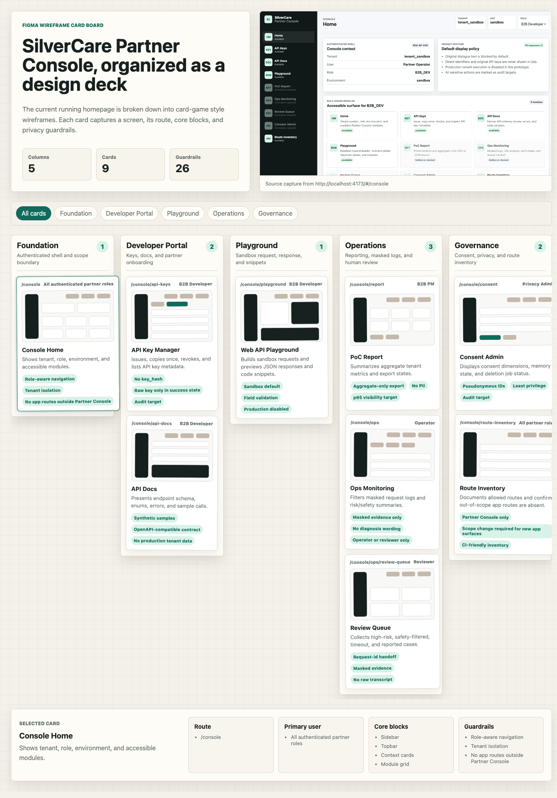

# SilverCare Partner Console UX Flow

검사용 UX flow 요약 문서입니다. 아래 이미지는 현재 `apps/wireframe-cards` 프로젝트의 전체 와이어프레임 카드 보드 프리뷰를 문서 자산으로 복사한 것입니다.

## Purpose

이 UX flow는 SilverCare Partner Console 프로토타입을 화면 단위로 검토하기 위한 기준 문서입니다. 대상은 B2B Partner Console이며, 보호자용 앱, 기관용 완성 대시보드, 어르신용 앱 화면은 범위에서 제외합니다.

## Flow Overview

1. Console Home에서 tenant, role, environment, 접근 가능한 module을 확인한다.
2. Developer Portal에서 API Key Manager와 API Docs를 통해 개발자 온보딩 흐름을 확인한다.
3. Playground에서 sandbox scenario, request builder, response viewer, snippet 흐름을 검증한다.
4. Operations에서 PoC Report, Ops Monitoring, Review Queue의 운영 흐름을 확인한다.
5. Governance에서 Consent Admin과 Route Inventory로 privacy, scope guard를 검토한다.

## Component Tree

아래 component tree는 `apps/web` 실행형 UI 프로젝트만 대상으로 한다. `apps/wireframe-cards` 카드 보드 프로젝트는 제외한다.

```mermaid
flowchart TD
  App["SilverCare Partner Console Prototype"]
  App --> Landing["Public Landing Page"]
  Landing --> LandingHero["Hero Hook"]
  Landing --> LandingCTA["Console CTA"]
  Landing --> LandingProof["Trust Metrics and Safety Proof"]

  App --> Shell["App Shell"]
  Shell --> Sidebar["Sidebar Navigation"]
  Shell --> Topbar["Topbar Context"]
  Shell --> Content["Route Content"]

  Sidebar --> NavItems["Role-Aware Nav Items"]
  Sidebar --> ScopeBadge["Partner Console Scope Badge"]

  Topbar --> TenantBadge["Tenant Badge"]
  Topbar --> EnvironmentBadge["Environment Badge"]
  Topbar --> RoleSwitcher["Mock Role Switcher"]

  Content --> Home["Console Home"]
  Content --> ApiKeys["API Key Manager"]
  Content --> ApiDocs["API Docs"]
  Content --> Playground["Web API Playground"]
  Content --> Report["PoC Report"]
  Content --> Ops["Ops Monitoring"]
  Content --> ReviewQueue["Review Queue"]
  Content --> Consent["Consent Admin"]
  Content --> RouteInventory["Route Inventory"]
  Content --> PermissionDenied["Permission Denied State"]

  Home --> ConsoleContext["Console Context Panel"]
  Home --> PrivacyPolicy["Default Display Policy Panel"]
  Home --> ModuleGrid["Accessible Module Grid"]

  ApiKeys --> KeyTable["API Key Metadata Table"]
  ApiKeys --> OneTimeReveal["One-Time Key Reveal"]
  ApiKeys --> KeyActions["Issue/Revoke Actions"]

  ApiDocs --> EndpointDocs["Endpoint Schema Cards"]
  ApiDocs --> EnumDocs["Enum Definitions"]
  ApiDocs --> ErrorDocs["Standard Error Table"]
  ApiDocs --> SampleSnippets["cURL/TypeScript Samples"]

  Playground --> RequestBuilder["Request Builder"]
  Playground --> ScenarioPicker["Sandbox Scenario Picker"]
  Playground --> ResponseViewer["Response Viewer"]
  Playground --> SnippetGenerator["Snippet Generator"]
  RequestBuilder --> EndpointSelector["Endpoint Selector"]
  RequestBuilder --> JsonEditor["JSON Request Editor"]
  RequestBuilder --> FieldValidation["Field-Level Validation"]

  Report --> PeriodFilter["Period Filter"]
  Report --> MetricTiles["Aggregate Metric Tiles"]
  Report --> ExportActions["CSV/JSON Export Actions"]

  Ops --> OpsFilters["Log Filters"]
  Ops --> MaskedLogTable["Masked Request Log Table"]
  Ops --> RiskSummary["Risk/Safety Summary Cards"]
  Ops --> ReviewLink["Review Queue Link"]

  ReviewQueue --> QueueCards["Review Queue Cards"]
  QueueCards --> RiskBadges["Risk/Error Badges"]
  QueueCards --> MaskedEvidence["Masked Evidence"]

  Consent --> ConsentTable["Consent Matrix Table"]
  Consent --> MemoryBadge["Memory Enabled Badge"]
  Consent --> DeletionAction["Deletion Request Action"]
  Consent --> DeletionStatus["Deletion Job Status"]

  RouteInventory --> RouteTable["Allowed Route Table"]
  RouteInventory --> RoleMatrix["Allowed Role Matrix"]
  RouteInventory --> ScopeGuard["Out-of-Scope Route Guard"]

  App --> Policies["Shared UI Policies"]
  Policies --> RoleAccess["Role Access Rules"]
  Policies --> RouteScope["Allowed Route Inventory"]
  Policies --> Redaction["Sensitive Text Redaction"]
  Policies --> ApiKeySafety["API Key One-Time Reveal Rule"]

  App --> MockData["Synthetic Mock Data"]
  MockData --> TenantData["Tenant/User Context"]
  MockData --> ApiData["API Schema and Key Data"]
  MockData --> SandboxData["Sandbox Scenarios and Responses"]
  MockData --> OpsData["Ops Logs and Review Events"]
  MockData --> ConsentData["Consent and Deletion Records"]
```

## Review Checklist

- Partner Console 화면만 포함되어 있는가?
- role별 접근 가능/불가 상태가 명확한가?
- API Key 원문, raw transcript, 직접 PII가 기본 UI에 노출되지 않는가?
- sandbox-first 흐름이 Playground에서 분명한가?
- 운영 화면은 masked evidence 중심으로 구성되어 있는가?
- Consent Admin은 가명 ID, 동의 상태, 삭제 job 상태만 보여주는가?
- Route Inventory가 out-of-scope route 추가를 막는 기준으로 보이는가?

## Source Projects

- `apps/web`: 실행형 Partner Console UI prototype
- `apps/wireframe-cards`: Figma 스타일 wireframe card board
