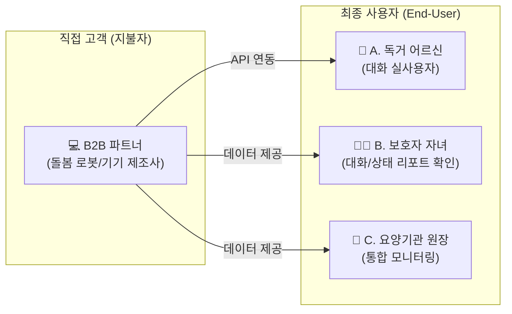
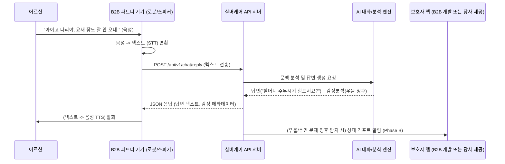

# 실버케어초안_PRD.v0.3.md
- **Owner 팀**: 이성국
- **최종 업데이트**: 2026-04-18 (비즈니스 모델 Pivot 반영)
- **문서 버전**: v0.3 (하드웨어 제조 → **API 플랫폼 B2B2C 모델**로 전면 개편)

> **서비스명**: 실버케어 — 시니어 특화 AI 캐릭터챗 및 돌봄 데이터 통합 API 플랫폼  
> **제품 비전**: "어떤 돌봄 기기든, 우리 API를 연결하면 '다정한 디지털 손주'이자 '똑똑한 헬스케어 비서'로 진화한다."

---

## 1. 개요·목표

### 1-1. 문제 정의 (B2B / B2C 양방향)

> **핵심 문제 1 (B2C/최종 사용자):** 독거 어르신의 극심한 외로움(우울증 16.1%)과 고독사 문제. 기존 돌봄 기기들은 '기계적'이라서 어르신들이 사용을 거부함.  
> **핵심 문제 2 (B2B/직접 고객):** 돌봄 로봇, 스마트 스피커, 태블릿 등을 만드는 **하드웨어 제조사**들은 기기는 잘 만들지만, 어르신의 마음을 열어줄 **'시니어 특화 AI 대화 소프트웨어(콘텐츠)'를 자체 개발할 역량이 부족**함.

| 문제 | 수치 (Pain 지표) | 관련 페르소나 |
|---|---|---|
| B2B 제조사의 AI S/W 자체 개발 비용 및 시간 | **수억 원 / 수개월** 소요 | 돌봄 기기 제조사 (B2B) |
| 독거 노인 우울 증상 경험률 | **16.1%** | 독거 어르신 (A) |
| 기존 돌봄 기기(스피커 등) 방치율 | 도입 1달 후 **70% 이상 사용 중단** | 독거 어르신 (A) |

### 1-2. 사업 전략: Phase A → Phase B 확장 모델

우리 서비스는 하드웨어를 직접 만들지 않는 **API 구독형(SaaS) 비즈니스**입니다.

*   **[Phase A] AI 캐릭터챗 API (현재 MVP):** 하드웨어 제조사가 우리 API를 호출하면, 어르신과 자연스럽게 대화하고 우울감을 분석해주는 '대화형 AI 지능'을 제공.
*   **[Phase B] 통합 돌봄 분석 API (확장):** 하드웨어 제조사가 자체적으로 수집한 '센서 데이터(레이더, 심박수 등)'를 우리 API로 보내주면, 대화 데이터와 결합해 낙상 감지, 치매 조기 징후 알림 등을 보호자와 기관(웹/앱)에 통합 리포트로 제공.

### 1-3. 성공 지표 (북극성 + 보조 KPI)

| 구분 | 지표 | 목표값 | 측정 주기 |
|---|---|---|---|
| ⭐ **북극성 KPI (Phase A)** | API 연동 B2B 파트너(제조사/통신사) 수 | **최소 3개사 확보** (PoC) | 반기 |
| ⭐ **북극성 보조** | 엔드유저(어르신) 일평균 대화 API 호출 횟수 | **인당 일 5회 이상** | 일간 |
| 보조 KPI 1 | AI API 응답 지연 시간 (Latency) | **≤ 800ms** | 실시간 |
| 보조 KPI 2 | 대화 기반 우울/위험 징후 감지 정확도 | **≥ 90%** | 월간 |

---

## 2. 사용자와 페르소나

### 2-1. API 비즈니스 기반 페르소나 재정의

| 페르소나 | 핵심 Pain (문제) | 우리 API가 주는 해결책 (Value) |
|---|---|---|
| **B2B 기기 제조사** | "기계를 팔아야 하는데 어르신이 쓸만한 콘텐츠(S/W)가 없다." | **API 연동 하루 만에 최고급 AI 챗봇 탑재 가능** |
| **A. 독거 어르신** | "혼자 있어서 너무 적적하고, 기계는 쓰기 어렵다." | **자연스러운 말동무 (내 말을 찰떡같이 알아들음)** |
| **B. 보호자 자녀** | "부모님이 오늘 하루 잘 지내셨는지 정서 상태가 궁금하다." | **대화 요약 기반의 '안심 감성 리포트' 수신** |

---

## 3. 사용자 스토리와 수용 기준 (AC)

### 3-1. Story B2B — 기기 제조사 (우리의 1차 타겟)

> **As a** 돌봄 로봇 하드웨어 제조사의 개발팀장,  
> **I want to** 자체 AI 모델을 개발하지 않고 검증된 시니어 특화 AI 대화 API를 연동해서  
> **so that** 제품 출시 일정을 단축하고 기기의 경쟁력을 높이고 싶다.

| # | AC (Given / When / Then) |
|:---:|---|
| AC-1 | **Given** 기기에서 어르신의 음성을 텍스트(STT)로 변환해 API로 전송하면, **When** 우리 AI 엔진이 이를 처리하여, **Then** 1초 이내에 시니어 맞춤형 대답 텍스트와 감정 코드(기쁨/슬픔 등)를 반환해야 한다. |
| AC-2 | **Given** B2B 개발자가 연동 테스트를 할 때, **When** 개발자 포털에 접속하면, **Then** API 명세서(Swagger)와 샘플 코드를 즉시 확인할 수 있어야 한다. |

### 3-2. Story A — 독거 어르신 (최종 사용자)

> **As a** 혼자 사는 독거 어르신,  
> **I want to** 기계가 사람처럼 내 이야기를 들어주고 어제 한 이야기도 기억해주길  
> **so that** 진짜 손주와 대화하는 것 같은 위로를 받고 싶다.

| # | AC (Given / When / Then) |
|:---:|---|
| AC-3 | **Given** 어르신이 며칠 전 "허리가 아프다"고 말한 데이터가 있을 때, **When** 오늘 기기가 먼저 말을 걸면, **Then** AI API는 "할머니, 며칠 전 아프다던 허리는 좀 어떠셔요?"라는 문맥 기반의 개인화된 대화를 생성한다. |

---

## 4. 기능 요구사항 (FR) — API 스펙 중심

### Phase A: Must Have (P0) — 캐릭터챗 API (MVP)

| ID | API 엔드포인트 기능 | 설명 | 타겟 |
|---|---|---|---|
| **F1** | **`/api/v1/chat/reply`** | **시니어 대화 생성 API:** 어르신의 발화 텍스트를 받아, LLM 기반의 친근한(존댓말, 사투리 반응 등) 대답을 생성. '기억 메모리' 기술로 이전 대화 문맥 유지. | B2B, A |
| **F2** | **`/api/v1/analyze/emotion`** | **감정/이상 징후 분석 API:** 대화 내용을 분석하여 '외로움', '우울', '통증 호소' 등의 감정 점수 및 위험 키워드를 추출하여 반환. | B2B, B |
| **F3** | **`/api/v1/schedule/proactive`** | **선제적 발화(먼저 말걸기) 생성 API:** 특정 시간(기상, 식사)에 기기가 먼저 말을 걸 수 있도록, 상황에 맞는 맞춤형 인사말이나 복약 독려 메시지를 생성. | B2B, A |

### Phase B: Should Have (P1) — 통합 돌봄 API (확장)

> B2B 파트너가 레이더/웨어러블 등의 데이터를 보내주면 분석해주는 기능

| ID | API 엔드포인트 기능 | 설명 | 타겟 |
|---|---|---|---|
| **F4** | **`/api/v2/sensor/ingest`** | **센서 데이터 수집 API:** B2B 기기의 레이더(수면, 움직임), 혈압계 등의 원시 데이터를 수신받아 시계열 DB에 저장. | B2B |
| **F5** | **`/api/v2/alert/emergency`** | **복합 이상 감지 Webhook:** 대화 중 비명 소리나 레이더 무활동 데이터가 결합되어 응급으로 판단될 시, 지정된 보호자/기관 서버로 즉시 Push 알림 발송. | B, C |
| **F6** | **`/api/v2/report/kpi`** | **보호자/기관 리포트 API:** 수집된 대화 및 센서 데이터를 바탕으로, 주간 정서 리포트, 수면 분석 결과, 기관용 성과(KPI) 데이터를 JSON 형태로 제공. | B, C, D |

---

## 5. 비기능 요구사항 (NFR)

### 5-1. 성능 및 확장성
*   **지연 시간 (Latency):** 대화 생성 API 응답 시간은 p95 기준 **800ms 이하**를 보장해야 한다. (자연스러운 핑퐁 대화를 위함)
*   **가용성:** API 서버 업타임 **99.9%** (SLA 기준 적용).
*   **동시 접속:** 10,000대 이상의 디바이스에서 동시 다발적으로 API를 호출해도 병목이 없도록 MSA 및 오토스케일링 구조로 설계.

### 5-2. 보안 및 프라이버시 (매우 중요)
*   **데이터 비식별화:** 대화 기록 수집 시 어르신의 실명, 주민번호, 주소 등 민감 개인정보(PII)는 AI 파이프라인에서 자동 마스킹(비식별화) 처리 후 저장.
*   **암호화:** 모든 API 통신은 TLS 1.3 기반 HTTPS 적용, 저장 데이터는 AES-256 암호화.
*   **다테넌시(Multi-Tenancy) 분리:** A제조사와 B제조사의 데이터는 철저히 격리되어야 함.

---

## 6. 시스템 아키텍처 개요 (API 연동 구조)

---

## 7. 리스크 및 설계 의사결정 (ADR)

### 7-1. 주요 리스크
| # | 리스크 | 파급력 | 대응 방안 |
|---|---|---|---|
| R1 | **LLM 환각(Hallucination) 현상** | 높음 (어르신에게 잘못된 의학 정보 제공 시 치명적) | 의료/처방 관련 질문은 절대 답변하지 않고, "가족이나 의사 선생님께 꼭 여쭤보세요"로 방어하도록 시스템 프롬프트(Guardrails) 강력 적용. |
| R2 | **B2B 파트너 확보 실패** | 매우 높음 (API 호출처 부재) | 기기 제조사뿐만 아니라 통신사, 지자체 자체 앱, 노인복지관 키오스크 등 API 연동 범위를 유연하게 타겟팅. MVP 단계 무료 PoC 연동 제공. |

### 7-2. 설계 의사결정 (ADR)
| ADR# | 결정 | 근거 |
|---|---|---|
| **ADR-001** | **음성(STT/TTS) 처리는 클라이언트(B2B 기기)에 위임하고 텍스트만 주고받음** | 음성 파일을 서버로 전송하면 트래픽 비용이 기하급수적으로 늘어나고 응답 속도가 느려짐. B2B 파트너가 자체 기기에서 음성 변환을 책임지고 API는 지능(텍스트/분석)만 담당하는 것이 가벼움. |
| **ADR-002** | **B2C 앱 직접 출시 대신 B2B2C API 모델 채택** | 하드웨어 제조, 물류, AS, 어르신 대상 CS(고객센터) 비용을 제거하여 소프트웨어 본연의 마진율과 확장성에 집중하기 위함. |

---

## 8. 실험 및 롤아웃 계획 (GTM)

### 8-1. Phase A (API 검증) 롤아웃
1. **내부 알파 테스트:** 가상의 할머니/할아버지 페르소나 봇 100개를 만들어 API 대화 시뮬레이션 (환각 및 지연시간 테스트).
2. **첫 번째 PoC (Proof of Concept):** 기존에 스피커나 로봇을 만들었으나 대화 AI가 부실한 **중소 제조사 1곳**을 선정. 무료로 API를 제공하고 어르신 50가구에서 실제 대화 품질 검증.
3. **지표 확인:** 어르신들이 로봇과 하루에 몇 번 대화하는가? (목표: 일 5회 이상)

### 8-2. Phase B (데이터 통합) 로드맵
* AI 챗봇으로 B2B 파트너들을 락인(Lock-in)시킨 후, 그들이 가지고 있는 센서 데이터(레이더, 웨어러블)를 연동할 수 있는 확장 API 오픈.
* 센서 + 대화 복합 AI 분석 보고서를 프리미엄(Premium) API 티어로 유료화.
