# SilverCare Partner Console Prototype

`tasks/tasks-list`의 frontend/UI 요구사항을 바탕으로 만든 dependency-free 실행형 Partner Console 프로토타입이다. 목적은 실제 백엔드 없이도 B2B partner console의 IA, role guard, privacy guardrail, developer/operator workflow를 검토하는 것이다.

## Status

- Stage: prototype review ready
- Scope: B2B Partner Console only
- Runtime: static SPA served by Node.js
- Real API/Auth/DB: not included
- Data: synthetic fixtures only
- Quality score: 7.4 / 10, prototype 기준

## Run

```bash
npm run dev
```

Open `http://localhost:4173`.

## Verify

```bash
npm test
npm run check
node --check src/app.mjs
node --check server.mjs
```

The tests cover:

- Partner Console route scope
- Role-based module visibility
- Sensitive display redaction
- API key one-time reveal behavior

## Included Surfaces

- Console Home
- API Key Manager
- API Docs
- Web API Playground
- PoC Report
- Ops Monitoring
- Review Queue
- User and Consent Admin
- Route Inventory

This prototype intentionally excludes guardian, institution, and elder-facing app routes.

## Component Tree

```mermaid
flowchart TD
  App["SilverCare Partner Console Prototype"]
  App --> Shell["App Shell"]
  Shell --> Sidebar["Sidebar Navigation"]
  Shell --> Topbar["Topbar Context Bar"]
  Shell --> Content["Route Content Renderer"]

  Sidebar --> NavItems["Role-Aware Nav Items"]
  Sidebar --> ScopeBadge["Partner Console Scope Badge"]

  Topbar --> TenantBadge["Tenant Badge"]
  Topbar --> EnvironmentBadge["Environment Badge"]
  Topbar --> RoleSwitcher["Mock Role Switcher"]

  Content --> Home["Console Home"]
  Content --> ApiKeys["API Key Manager"]
  Content --> ApiDocs["API Docs"]
  Content --> Playground["Web API Playground"]
  Content --> Report["PoC Report"]
  Content --> Ops["Ops Monitoring"]
  Content --> ReviewQueue["Review Queue"]
  Content --> Consent["Consent Admin"]
  Content --> RouteInventory["Route Inventory"]
  Content --> PermissionDenied["Permission Denied State"]

  App --> Policies["src/policies.mjs"]
  Policies --> RoleAccess["Role Access Rules"]
  Policies --> RouteScope["Allowed Route Inventory"]
  Policies --> Redaction["Sensitive Text Redaction"]
  Policies --> ApiKeySafety["API Key One-Time Reveal Rule"]

  App --> MockData["src/mock-data.mjs"]
  MockData --> ApiData["API Schema and Key Data"]
  MockData --> SandboxData["Sandbox Scenarios and Responses"]
  MockData --> OpsData["Ops Logs and Review Events"]
  MockData --> ConsentData["Consent and Deletion Records"]
```



Full component analysis: [`docs/component-structure-analysis.md`](docs/component-structure-analysis.md)

## Project Structure

```text
prototype/healthcare-prototype-ui-codex
├── README.md
├── docs
│   ├── code-quality-evaluation.md
│   ├── component-structure-analysis.md
│   └── master-prompt.md
├── index.html
├── package.json
├── server.mjs
├── src
│   ├── app.mjs
│   ├── mock-data.mjs
│   ├── policies.mjs
│   └── styles.css
└── tests
    └── policies.test.mjs
```

## Key Scripts

- `src/app.mjs`: static SPA renderer, in-memory state, route rendering, and UI action handling.
- `src/policies.mjs`: role access, route scope, privacy redaction, API key one-time reveal policy.
- `src/mock-data.mjs`: synthetic fixture data for tenant context, API schema, sandbox responses, reports, ops logs, and consent records.
- `server.mjs`: small static file server with SPA fallback.
- `tests/policies.test.mjs`: policy regression tests.

The major scripts now include JSDoc-style comments written for both human developers and AI agents. The comments mark which file owns rendering, policy, fixture, and server responsibilities so later work does not blur those boundaries.

## Current Strengths

- No dependency install is required beyond Node.js.
- Route scope is limited to Partner Console and verified by tests.
- Role-based module visibility is centralized in `src/policies.mjs`.
- API key raw value is shown only in a one-time issue state and stripped from list rows.
- Mock data is synthetic and separated from rendering.
- Docs now include component structure and code quality evaluation.

## Known Gaps

- `src/app.mjs` is still a single large renderer. It is acceptable for prototype review, but should be split before productization.
- UI tests are policy-focused. Browser smoke tests should be added for route rendering and permission denied states.
- Request validation is minimal and should eventually derive from an OpenAPI-compatible schema.
- Accessibility has basic labels and semantic tables, but no focus-order or keyboard audit yet.

## Documentation

- [`docs/master-prompt.md`](docs/master-prompt.md): original prototype generation prompt.
- [`docs/component-structure-analysis.md`](docs/component-structure-analysis.md): component hierarchy, Mermaid chart, current structure, and improvement points.
- [`docs/code-quality-evaluation.md`](docs/code-quality-evaluation.md): code quality score, strengths, risks, and recommended quality gates.

## Review Notes

- Auth is represented by a mock session and role switcher.
- No real API, database, tenant, or production environment call is performed.
- Raw transcript, direct PII, original API keys, `key_hash`, and production tenant payloads should not appear in default UI.
- Sensitive actions are represented as prototype actions and audit targets, not real audit log integrations.
