# Component Structure Analysis

이 문서는 `prototype/healthcare-prototype-ui-codex` 실행형 프로토타입의 컴포넌트 구조 현황과 개선점을 정리한다. 현재 구현은 프레임워크 의존성 없이 `src/app.mjs`가 public landing page와 Partner Console 전체 UI를 렌더링하는 정적 SPA 형태다.

## Component Tree

```mermaid
flowchart TD
  App["SilverCare Partner Console Prototype"]
  App --> Landing["Public Landing Page"]
  Landing --> LandingNav["Landing Navigation"]
  Landing --> Hero["Hero Hook + Actual Console Background"]
  Landing --> TrustMetrics["Trust Metrics"]
  Landing --> CapabilityProof["Capability Proof Strip"]
  Landing --> Workflow["A to Z Workflow Journey"]
  Landing --> Safety["Safety Check Grid"]
  Landing --> ValueProps["Audience Value Cards"]
  Landing --> FinalCTA["Final Console CTA"]

  App --> Shell["App Shell"]
  Shell --> Sidebar["Sidebar Navigation"]
  Shell --> Topbar["Topbar Context Bar"]
  Shell --> Content["Route Content Renderer"]

  Sidebar --> NavItems["Role-Aware Nav Items"]
  Sidebar --> ScopeBadge["Partner Console Scope Badge"]

  Topbar --> TenantBadge["Tenant Badge"]
  Topbar --> EnvironmentBadge["Environment Badge"]
  Topbar --> RoleSwitcher["Mock Role Switcher"]

  Content --> Home["Console Home"]
  Content --> ApiKeys["API Key Manager"]
  Content --> ApiDocs["API Docs"]
  Content --> Playground["Web API Playground"]
  Content --> Report["PoC Report"]
  Content --> Ops["Ops Monitoring"]
  Content --> ReviewQueue["Review Queue"]
  Content --> Consent["Consent Admin"]
  Content --> RouteInventory["Route Inventory"]
  Content --> PermissionDenied["Permission Denied State"]

  Home --> ConsoleContext["Console Context Panel"]
  Home --> PrivacyPolicy["Default Display Policy Panel"]
  Home --> ModuleGrid["Accessible Module Grid"]

  ApiKeys --> KeyTable["API Key Metadata Table"]
  ApiKeys --> OneTimeReveal["One-Time Key Reveal"]
  ApiKeys --> KeyActions["Issue/Revoke Actions"]

  ApiDocs --> EndpointDocs["Endpoint Schema Cards"]
  ApiDocs --> EnumDocs["Enum Definitions"]
  ApiDocs --> ErrorDocs["Standard Error Table"]
  ApiDocs --> Samples["cURL Sample"]

  Playground --> RequestBuilder["Request Builder"]
  Playground --> ScenarioPicker["Sandbox Scenario Picker"]
  Playground --> ResponseViewer["Response Viewer"]
  Playground --> SnippetGenerator["cURL/TypeScript Snippet Generator"]
  RequestBuilder --> EndpointSelector["Endpoint Selector"]
  RequestBuilder --> JsonEditor["JSON Request Editor"]
  RequestBuilder --> FieldValidation["Field-Level Validation"]

  Report --> PeriodFilter["Period Filter"]
  Report --> MetricTiles["Aggregate Metric Tiles"]
  Report --> ExportActions["CSV/JSON Export Mock Actions"]

  Ops --> OpsFilters["Log Filters"]
  Ops --> MaskedLogTable["Masked Request Log Table"]
  Ops --> RiskSummary["Risk/Safety Summary Cards"]
  Ops --> ReviewLink["Review Queue Link"]

  ReviewQueue --> QueueCards["Review Queue Cards"]
  QueueCards --> RiskBadges["Risk/Error Badges"]
  QueueCards --> MaskedEvidence["Masked Evidence"]

  Consent --> ConsentTable["Consent Matrix Table"]
  Consent --> MemoryBadge["Memory Enabled Badge"]
  Consent --> DeletionAction["Deletion Request Action"]
  Consent --> DeletionStatus["Deletion Job Status"]

  RouteInventory --> RouteTable["Allowed Route Table"]
  RouteInventory --> RoleMatrix["Allowed Role Matrix"]
  RouteInventory --> ScopeGuard["Out-of-Scope Route Guard"]

  App --> Policies["src/policies.mjs"]
  Policies --> LandingRoute["Public Landing Route"]
  Policies --> RoleAccess["Role Access Rules"]
  Policies --> RouteScope["Allowed Route Inventory"]
  Policies --> Redaction["Sensitive Text Redaction"]
  Policies --> ApiKeySafety["API Key One-Time Reveal Rule"]

  App --> MockData["src/mock-data.mjs"]
  MockData --> TenantData["Tenant/User Context"]
  MockData --> ApiData["API Schema and Key Data"]
  MockData --> SandboxData["Sandbox Scenarios and Responses"]
  MockData --> OpsData["Ops Logs and Review Events"]
  MockData --> ConsentData["Consent and Deletion Records"]
```

## Current Structure

- `index.html`: SPA mount point. `src/app.mjs`를 module script로 로드한다.
- `assets/console-home-preview.png`: 랜딩 히어로 배경으로 쓰이는 실제 Partner Console 캡처 이미지다.
- `src/app.mjs`: landing page, 라우팅, 상태, 이벤트 핸들링, 화면별 HTML 렌더링을 담당한다.
- `src/policies.mjs`: public landing route, protected console route scope, role access, privacy redaction, API key one-time reveal 같은 정책성 로직을 담당한다.
- `src/mock-data.mjs`: synthetic tenant, API schema, sandbox scenario, response, report, ops, consent 데이터를 제공한다.
- `src/styles.css`: landing page, Partner Console 레이아웃, 표, 카드, badge, responsive style을 담당한다.
- `server.mjs`: dependency-free static file server이며 SPA fallback을 제공한다.
- `tests/policies.test.mjs`: landing route separation, route scope, role visibility, sensitive redaction, API key one-time reveal 정책을 검증한다.

## Strengths

- 정책 로직이 `src/policies.mjs`로 분리되어 있어 privacy/security guard를 테스트하기 쉽다.
- public landing route가 protected console route inventory와 분리되어 있어 마케팅 진입면과 검증 대상 콘솔 범위를 혼동하지 않는다.
- mock data가 별도 파일로 분리되어 화면 렌더링 코드와 fixture를 구분한다.
- dependency-free 구조라 reviewer가 별도 install 없이 Node.js만으로 실행할 수 있다.
- UI 범위가 Partner Console로 고정되어 guardian, institution, elder-facing route 확산을 막는다.
- route guard 실패 시 `Permission Denied State`를 렌더링하여 권한 없는 role에서 tenant data가 보이지 않는다.

## Improvement Points

- `src/app.mjs`가 화면 렌더링, 상태 변경, action handling을 모두 담고 있어 프로토타입 이후에는 모듈 분리가 필요하다.
- landing page와 console renderer가 같은 파일에 있어 후속 고도화 시 `renderLanding()` 계열을 별도 모듈로 분리하는 편이 좋다.
- `render*` 함수들이 문자열 template을 직접 반환하므로 UI 변경이 많아지면 재사용성과 testability가 떨어진다.
- 랜딩 신뢰 증거는 내부 capability proof 중심이다. 실제 고객 검증 단계 전에는 권위자 추천, 파트너 로고, 보안/컴플라이언스 증빙을 보강해야 한다.
- `validateRequest()`는 최소 schema 검증만 수행한다. 실제 제품화 단계에서는 endpoint contract 기반 validator로 교체해야 한다.
- 현재 테스트는 정책 로직 중심이다. 화면 단위 smoke test와 DOM-level assertion은 별도 브라우저 테스트로 보강하는 편이 좋다.
- mock role model이 단순하다. 실제 RBAC contract와 연결할 때 action-level permission matrix를 명시적으로 분리해야 한다.

## Recommended Next Refactor

1. `src/app.mjs`를 `src/renderers/landing.mjs`, `src/renderers/console/*.mjs`, `src/actions.mjs`, `src/state.mjs`로 분리한다.
2. `landingRoute`, protected `allowedRoutes`, navigation metadata를 명확히 나눈다.
3. Playground request validation을 endpoint schema에서 파생되도록 만든다.
4. privacy redaction 테스트에 화면 fixture 기반 negative assertion을 추가한다.
5. Playwright smoke test로 landing CTA, 각 route 렌더링, role switch, permission denied state를 검증한다.
